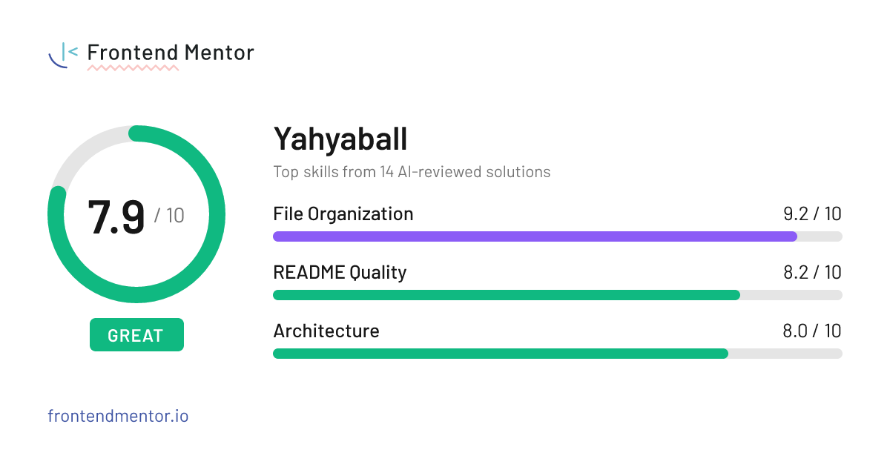

### Hi, I'm Yahyaball
**Junior Front-End Developer** based in Indonesia. Passionate about building modern, responsive, and accessible web applications.

---

### Tech Stack
* **Languages & Frameworks:** JavaScript (ES6+), Vue.js, Vite
* **Styling & Markup:** HTML5, CSS3, SASS/SCSS
* **Tools:** Git, GitHub, Vercel, Firebase

---

### Frontend Mentor Score

  

